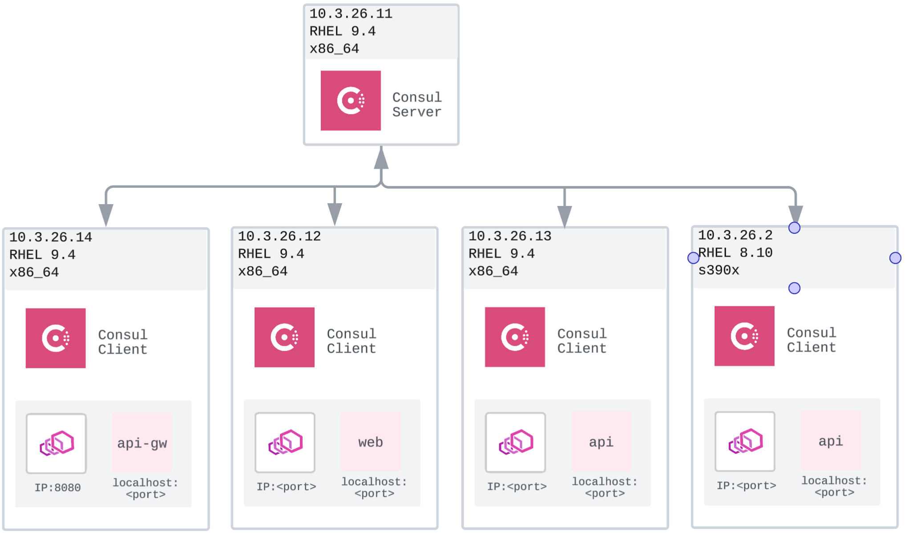

# Consul Service Mesh Setup Summary

This demo showcases a multi-architecture Consul Service Mesh deployment, integrating x86_64 and IBM LinuxONE (s390x) nodes. It demonstrates secure service-to-service communication, automated service discovery, and centralized observability using Consul and Envoy sidecars. The setup includes a Consul server, multiple service clients, and an API gateway, illustrating real-world patterns for resilient, scalable, and secure microservice architectures.

## Demo Architecture

*Diagram: Consul server, service clients (web, api, db), and API gateway interconnected via Envoy sidecars. Multi-architecture support shown with x86_64 and s390x nodes.*
The demo architecture consists of a Consul server managing service registration and health, multiple service clients (web, api, db) running on both x86_64 and s390x platforms, and an API gateway for external access. Each service is paired with an Envoy sidecar to enforce secure, encrypted communication and enable service mesh features. This setup demonstrates interoperability between different hardware architectures, centralized service discovery, and secure traffic routing within a resilient microservices environment.

## Infrastructure

| VM IP Address | Role | Architecture | Service Name | Purpose |
|---------------|------|--------------|--------------|----------|
| **10.3.26.11** | Consul Server | x86_64 | consul | Control plane, service catalog, UI |
| **10.3.26.12** | Service Client | x86_64 | web | Web frontend application |
| **10.3.26.13** | Service Client | x86_64 | api | API backend application |
| **10.3.26.2** | Service Client | s390x | db | Database service (LinuxONE) |
| **10.3.26.14** | API Gateway | x86_64 | api-gateway | External traffic ingress point |


## Component Details

### Consul Server (10.3.26.11)
- **Role**: Central control plane and service catalog
- **Components**: 
  - Consul server with Raft consensus
  - Web UI accessible at http://10.3.26.11:8500
  - Service registry and health monitoring
  - Configuration storage and distribution

### Service Clients

#### Web Service (10.3.26.12 - x86_64)
- **Application**: fake-service simulating web frontend
- **Consul Client**: Registers as "web" service
- **Envoy Sidecar**: Handles all inbound/outbound traffic
- **Security**: Service listens on loopback (127.0.0.1:9090)

#### API Service (10.3.26.13 - x86_64) 
- **Application**: fake-service simulating API backend
- **Consul Client**: Registers as "api" service  
- **Envoy Sidecar**: Manages service mesh connectivity
- **Security**: Service listens on loopback (127.0.0.1:9090)

#### Database Service (10.3.26.2 - s390x LinuxONE)
- **Application**: fake-service simulating database
- **Consul Client**: Registers as "db" service
- **Envoy Sidecar**: s390x-compiled proxy for LinuxONE
- **Security**: Service listens on loopback (127.0.0.1:9090)

### API Gateway (10.3.26.14)
- **Role**: External traffic ingress point


## Key Security Features

### 🔒 Secure Service-to-Service Communication

**Secured Traffic Flow Example:**

1. **User Request:**  
  - A user sends an HTTP request to the API Gateway (`http://10.3.26.14:8080`).
  - The API Gateway is the only externally accessible entry point.

2. **API Gateway to Web Service:**  
  - The API Gateway forwards the request to the web service (`web`) via its Envoy sidecar.
  - Traffic is encrypted and authenticated between Envoy proxies.
  - The web service listens only on `127.0.0.1:9090`, so direct external access is blocked.

3. **Web Service to API Service:**  
  - The web service, after processing, calls the API service (`api`) through its Envoy sidecar.
  - Envoy proxies handle mutual TLS (mTLS) authentication and encryption.
  - The API service also listens on `127.0.0.1:9090`, ensuring isolation.

4. **API Service to Database:**  
  - The API service requests data from the database service (`db`) on the s390x LinuxONE node.
  - Communication is routed through Envoy sidecars, enforcing mTLS and policy checks.
  - The database service is only accessible via the mesh, never directly.

**Summary:**  
At every hop, traffic is routed through Envoy sidecars, which enforce authentication, encryption, and access control. No service is directly exposed; all communication is internal and secured by the service mesh.

**Zero Trust Network Model:**
- All services bind to loopback interface (127.0.0.1)
- **No direct service access** from external networks
- All traffic flows through authenticated Envoy sidecars
- Service mesh provides encrypted communication channels

### 🎯 Service Discovery & Registration

**Automatic Service Registration:**
- Services self-register with Consul on startup
- Health checks ensure only healthy instances receive traffic
- Real-time service topology updates

**DNS-Based Discovery:**
- Services resolvable via `<service>.service.consul`
- Automatic load balancing across healthy instances

**Service Catalog:**
- Centralized inventory of all services
- Metadata and tags for service classification
- Health status and endpoint information

## Demo

### 1. Service Mesh Connectivity
```bash
# Direct service access (blocked - security feature)
curl http://10.3.26.12:9090  # ❌ Connection refused

# Access via service mesh (secure)
curl http://10.3.26.14:8080  # ✅ Routes through API Gateway
```

### 2. Service Discovery
```bash
# DNS resolution through Consul
dig @10.3.26.11 -p 8600 web.service.consul

# Service health status
curl http://10.3.26.11:8500/v1/health/service/api
```

## Access Points for Demo

| Component | Access Method | URL/Command |
|-----------|---------------|-------------|
| Consul UI | Web Browser | http://10.3.26.11:8500 |
| API Gateway | HTTP Client | http://10.3.26.14:8080 |

## Further Reading

For detailed setup instructions and step-by-step guidance on deploying the Consul demo environment, see the [README.md](README.md).